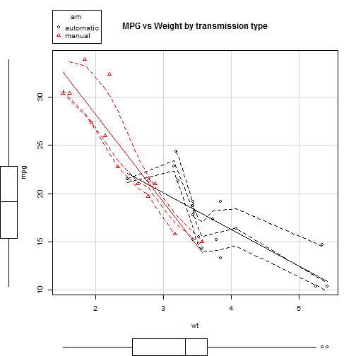
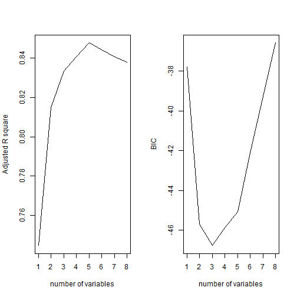
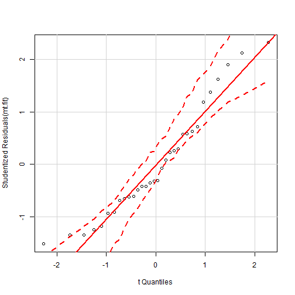
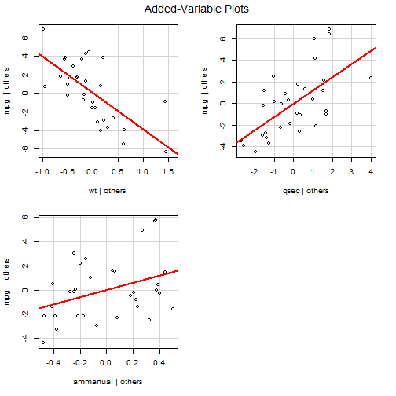
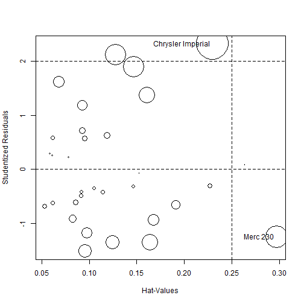

## Overview
The assignment requires an investigation into the R data set "mtcars".
The data set is for a collection of cars, and we are asked in exploring the relationship between a set of variables and miles per gallon (MPG) (outcome). We are particularly interested in the following two questions:

- Is an automatic or manual transmission better for MPG
- Quantify the MPG difference between automatic and manual transmissions

## The art of statistics
In a way statistics is nothing more than dumb number crunching. The algorithm applied (however sophisticated) is not capable of giving an interpretation to the outcome nor understanding the wider context. This paper attempts to apply statistics to find answers to the questions asked above, but before we jump into the math, let's summarise what we know about the topic (and yes, that knowledge is heavily loaded with prejudices, hidden agenda's etc ...).
The data set under investigation was extracted from the 1974 Motor Trend US magazine, a time when the author was still in the business of playing with toy cars. Winding forward a bit in time, knowledge of mechanical engineering was added and complicated formula's studied. It seems unlikely Newton knew about the car business but in his famous law $F=ma$ he got to the core issue: weight is everything. No mentioning of automatic transmission yet in Newton's time. Being European, I'm more than convinced that automatic transmission is a sure recipe for consuming extra fuel and should be left to the guys who can't drive a car. (Never mind I seriously consider to join that last mentioned team ...)
So let's move on and explore that famous data set and after that see if the math theory supports my hypotheses that automatic transmission consumes definitely more fuel than a manual transmission.


## Exploratory data analysis
The data frame has 32 observations on 11 variables. It is noted that the split between automatic and manual transmission cars is unbalanced.

```r
table(mtcars$am)
```

```
## 
## automatic    manual 
##        19        13
```

Looking at the 2 simple box plots in the appendix shows that the automatic transmission cars in the data set consume clearly less fuel than manual transmission cars. (thanks, there goes my hypotheses) However, remember Newton, the second box plot shows that in this data set the automatic cars tend to be much heavier.

The scatterplots in the appendix reveal that other factors than transmission type are more correlated with MPG. Let's see what regression models have to say about that.

## The science of statistics
Considering the data set is very small, we can afford to do a best subset selection trying out all possible combinations.
The chunk of code below suggest that 3 variables (following the Bayesian information criteria) provides an optimal result. These 3 variables are wt, qsec and transmission type. (see appendix for plots of Adjr2 and BIC)
Weight was predicted, by why qsec ? It seems obvious that qsec (1/4 mile time) is a result of applying horse power (hp) (generated from a certain displacement in cu.in. engine) to a weight and as such it is understandable that the algorithm detected that this variable explains a lot of the variance. Transmission type does not add much.

```r
car.full <- regsubsets(mpg ~., data = mtcars)
car.sum <-summary(car.full)
car.sum$which[1:4, 5:10]
```

```
##      hp  drat   wt  qsec    vs ammanual
## 1 FALSE FALSE TRUE FALSE FALSE    FALSE
## 2  TRUE FALSE TRUE FALSE FALSE    FALSE
## 3 FALSE FALSE TRUE  TRUE FALSE     TRUE
## 4  TRUE FALSE TRUE FALSE FALSE     TRUE
```

Let's double check above by having a hierarchy of models and applying anova. It shows that the third model is on the edge of still being significant.

```r
car.fit1 <- lm(mpg ~ wt, data = mtcars)
car.fit2 <- lm(mpg ~ wt + hp, data = mtcars)
car.fit3 <- lm(mpg ~ wt + qsec + am, data = mtcars)
anova(car.fit1, car.fit2, car.fit3)
```

```
## Analysis of Variance Table
## 
## Model 1: mpg ~ wt
## Model 2: mpg ~ wt + hp
## Model 3: mpg ~ wt + qsec + am
##   Res.Df    RSS Df Sum of Sq      F    Pr(>F)    
## 1     30 278.32                                  
## 2     29 195.05  1    83.274 13.774 0.0009062 ***
## 3     28 169.29  1    25.762  4.261 0.0483725 *  
## ---
## Signif. codes:  0 '***' 0.001 '**' 0.01 '*' 0.05 '.' 0.1 ' ' 1
```


A last check of regression diagnositics shows a couple of indicators (like VIF) are just acceptable. The appendix contains the diagnostics plots. The selected regression model shows that the coefficient for Manual transmission type is 2.9 (=2.9 MPG extra compared to automatic). This is also illustrated in the scatterplot (MPG vs Weight by Transmission Type) in which the manual regression line has a higher negative slope (higher impact).
I have to conclude that my hypotheses is not supported by this data set.

```r
contrasts(mt$am)
```

```
##           manual
## automatic      0
## manual         1
```

```r
summary(mt.fit)
```

```
## 
## Call:
## lm(formula = mpg ~ wt + qsec + am, data = mtcars)
## 
## Residuals:
##     Min      1Q  Median      3Q     Max 
## -3.4811 -1.5555 -0.7257  1.4110  4.6610 
## 
## Coefficients:
##             Estimate Std. Error t value Pr(>|t|)    
## (Intercept)   9.6178     6.9596   1.382 0.177915    
## wt           -3.9165     0.7112  -5.507 6.95e-06 ***
## qsec          1.2259     0.2887   4.247 0.000216 ***
## ammanual      2.9358     1.4109   2.081 0.046716 *  
## ---
## Signif. codes:  0 '***' 0.001 '**' 0.01 '*' 0.05 '.' 0.1 ' ' 1
## 
## Residual standard error: 2.459 on 28 degrees of freedom
## Multiple R-squared:  0.8497,	Adjusted R-squared:  0.8336 
## F-statistic: 52.75 on 3 and 28 DF,  p-value: 1.21e-11
```

```r
vif(mt.fit)
```

```
##       wt     qsec       am 
## 2.482952 1.364339 2.541437
```

```r
outlierTest(mt.fit)
```

```
## 
## No Studentized residuals with Bonferonni p < 0.05
## Largest |rstudent|:
##                   rstudent unadjusted p-value Bonferonni p
## Chrysler Imperial 2.323119           0.027949      0.89437
```


## Appendix : graphs
### Exploration : Simple Boxplots
 

### Exploration : Scatterplots
  

### Best subset selection
 

### Validation of the regression model (lm(mpg ~ wt + qsec + am, data = mtcars)

```r
qqPlot(mt.fit)
```

 

```r
avPlots(mt.fit)
```

 

```r
influencePlot(mt.fit)
```

 

```
##                     StudRes       Hat     CookD
## Merc 230          -1.251106 0.2970422 0.4025949
## Chrysler Imperial  2.323119 0.2296338 0.5895739
```

## References

1. An introduction to Statistical Learning (James - Witten - Hastie - Tibshirani)
2. R in Action (Kabacoff)
3. Discovering Statistics Using R (Field)

Source code available on Github https://github.com/stefMT2970/mtCars
