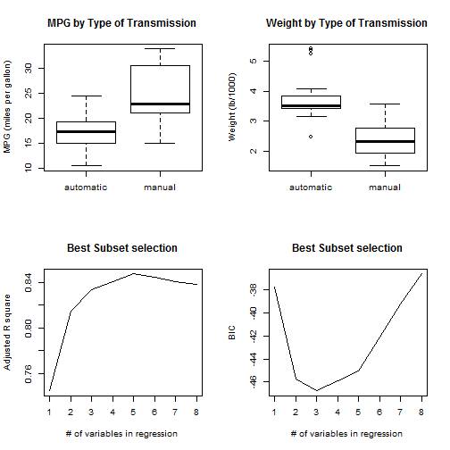
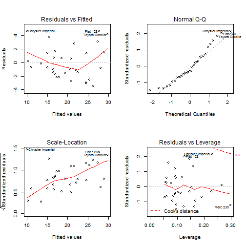
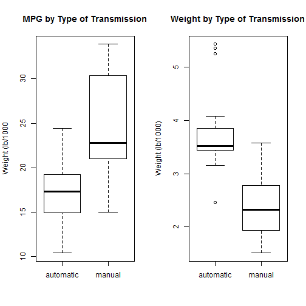
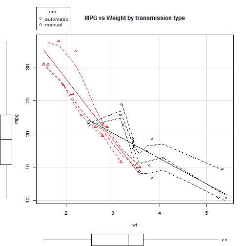
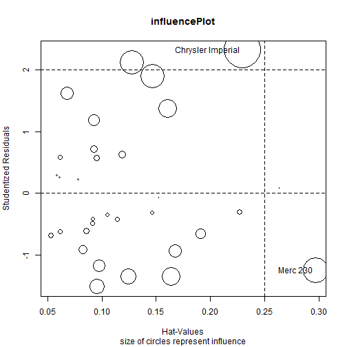

## Overview
The assignment requires an investigation into the R data set "mtcars".
The data set is for a collection of cars, and we are asked :

- Is an automatic or manual transmission better for MPG ?
- Quantify the MPG difference between automatic and manual transmissions ?

## The art of statistics
In a way statistics resembles dumb number crunching. The algorithm applied (however sophisticated) is not capable of giving an *interpretation* to the outcome nor understanding the wider context. This paper attempts to apply statistics to find answers to the questions asked above, but before we jump into the math, let's summarise what we know about the topic (and yes, that knowledge is heavily loaded with prejudices, hidden agenda's etc ...).
The data set under investigation was extracted from the 1974 Motor Trend US magazine, a time when myself I was still in the business of playing with toy cars. Moving forward in time, I increased knowledge of mechanical engineering and complicated formula's were studied. It seems unlikely Newton knew about the car business but in his famous law $F=ma$ he got to the core issue: weight is everything. No mentioning of automatic transmissions yet in Newton's time. Being European, I'm more than convinced that automatic transmissions are a sure recipe for consuming extra fuel and should be left to the guys who can't drive a car. (Never mind I seriously consider to join that last mentioned team ...)
So let's move on and explore that famous data set and after that see if the math theory supports my hypotheses that an automatic transmission consumes definitely more fuel than a manual transmission.


## Exploratory data analysis
The data frame has 32 observations on 11 variables. 19 observations are for automatic transmission cars and 13 for manual transmission cars. There are no records which allow to compare manual vs automatic transmission for the same models (no paired test possible).

Looking at the 2 simple box plots in the appendix shows that the automatic transmission cars in the data set consume clearly less fuel than manual transmission cars. (Thanks, there goes my hypotheses.) However - remember Newton - the second box plot shows that in this data set the automatic cars tend to be much heavier. The scatterplots in the appendix reveal that other factors than transmission type are more correlated with MPG. Let's see what regression models have to say about that.

## The science of statistics
Considering the data set is very small, we can afford to do a best subset selection for linear regression models trying out all possible combinations.
The chunk of code below suggest that 3 variables (following the Bayesian information criteria) provides an optimal result. These 3 variables are wt, qsec and transmission type. (see appendix for Best Subset plots of Adjr2 and BIC).Weight was predicted by Newton already, but why qsec (1/4 mile time) ? It seems obvious that qsec is a result of applying horse power (hp) (generated from a certain displacement in cu.in. engine) to a weight and as such it is understandable that the algorithm detected that this variable explains a lot of the variance. Transmission type does not remove much variance.

```r
car.sum <- summary(regsubsets(mpg ~., data = mtcars))
car.sum$which[which.min(car.sum$bic), 5:10]
```

```
##       hp     drat       wt     qsec       vs ammanual 
##    FALSE    FALSE     TRUE     TRUE    FALSE     TRUE
```

Let's double check above by having a hierarchy of models and applying anova. It shows that the third model is on the edge ($p < 0.05$) of still being significant. The impact of transmission type on fuel consumption in this data set is not strong.

```r
car.fit1 <- lm(mpg ~ wt, data = mtcars)
car.fit2 <- lm(mpg ~ wt + qsec, data = mtcars)
car.fit3 <- lm(mpg ~ wt + qsec + am, data = mtcars)
anova(car.fit1, car.fit2, car.fit3)
```

```
## Analysis of Variance Table
## 
## Model 1: mpg ~ wt
## Model 2: mpg ~ wt + qsec
## Model 3: mpg ~ wt + qsec + am
##   Res.Df    RSS Df Sum of Sq       F    Pr(>F)    
## 1     30 278.32                                   
## 2     29 195.46  1    82.858 13.7048 0.0009286 ***
## 3     28 169.29  1    26.178  4.3298 0.0467155 *  
## ---
## Signif. codes:  0 '***' 0.001 '**' 0.01 '*' 0.05 '.' 0.1 ' ' 1
```


The appendix contains the standard diagnostics plots for the selected model (mpg~wt+qsec+am) and show a slight deviation from a normal distribution. VIF shows a slight multicollinearity effect. The selected regression model shows that the coefficient for Manual transmission type is 2.9 (=2.9 MPG extra compared to automatic). 
I have to conclude that my initial hypotheses is not supported by this data set. Statististics are in favour of supporting the hypotheses that manual transmission cars consume more fuel than automatic transmission cars although the effect is small.

```r
coef(mt.fit); confint(mt.fit) 
```

```
## (Intercept)          wt        qsec    ammanual 
##    9.617781   -3.916504    1.225886    2.935837
```

```
##                   2.5 %    97.5 %
## (Intercept) -4.63829946 23.873860
## wt          -5.37333423 -2.459673
## qsec         0.63457320  1.817199
## ammanual     0.04573031  5.825944
```

```r
vif(mt.fit)
```

```
##       wt     qsec       am 
## 2.482952 1.364339 2.541437
```

## Appendix : graphs
  


  


 

```
##                     StudRes       Hat     CookD
## Merc 230          -1.251106 0.2970422 0.4025949
## Chrysler Imperial  2.323119 0.2296338 0.5895739
```

## References

1. An introduction to Statistical Learning (James - Witten - Hastie - Tibshirani)
2. R in Action (Kabacoff)
3. Discovering Statistics Using R (Field)

Source code available on Github https://github.com/stefMT2970/mtCars
